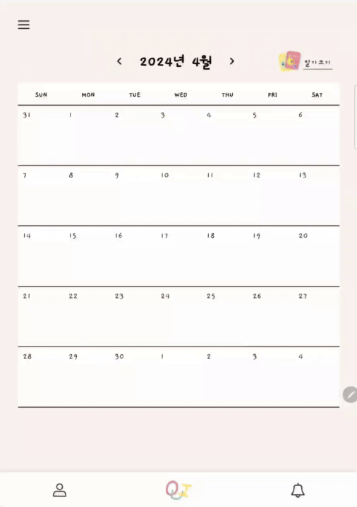

# ✏️ OUI: 너와 나의 공유일기

> #### OUI _는 **AI 감정분석을 제공하는 공유일기 웹 앱 서비스**입니다._

# 1. 서비스 구조도
### 메인화면

### 일기 생성

### 일기 조회

### 일정 생성/조회

### 개인 통계

### 공유 통계

### 회원가입
|  |
|------------|

### 일기
|  |  |
|:------------:|:------------:|
| <b>1. 일기작성</b>  | <b>2. 일기 꾸미기(동시편집)</b>  |

### 알림
|  |
|------------|

### 공유 다이어리 생성
|  |
|------------|

### 분석
|  |  |
|:------------:|:------------:|
| <b>1. 감정통계</b>  | <b>2. 분석결과</b> |

# 2. 주요 기능
### 일기 작성
> 텍스트, 손글씨, 이미지로 일기를 작성해보세요~📚

### 감정 분석
> ✏️ 작성한 텍스트를 기반으로 감정을 분석해드려요!

### 노래 추천
> 오늘의 감정과 유사한 가사의 노래를 추천해드려요~🎧♭

### 공유 일기
> 💁🏻 친구와 하루를 공유해보세요! 친구가 쓴 일기를 꾸밀수도 있답니다~ 🙆🏻

# 3. 핵심 기술
### 웹 소켓을 사용한 동시편집

### AI 감정분석

# 4. 설계
### 아키텍처

### ERD

# 5. 기술 스택

### FE

### BE

  

  

  

### INFRA

  

### AI

## 🍎 팀원 🍎
| 권송아 | 권유경 | 김선영 | 정민지 | 조권호 | 현민수 |
| :--: | :--: | :--: | :--: | :--: | :--: |
| AI, BE | BE | FE | BE | Infra, BE, FE | BE, FE |

